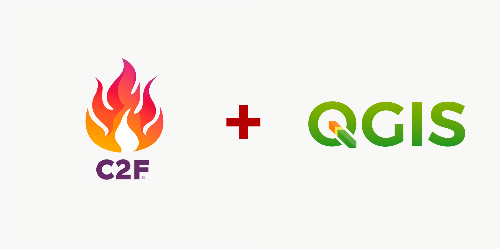
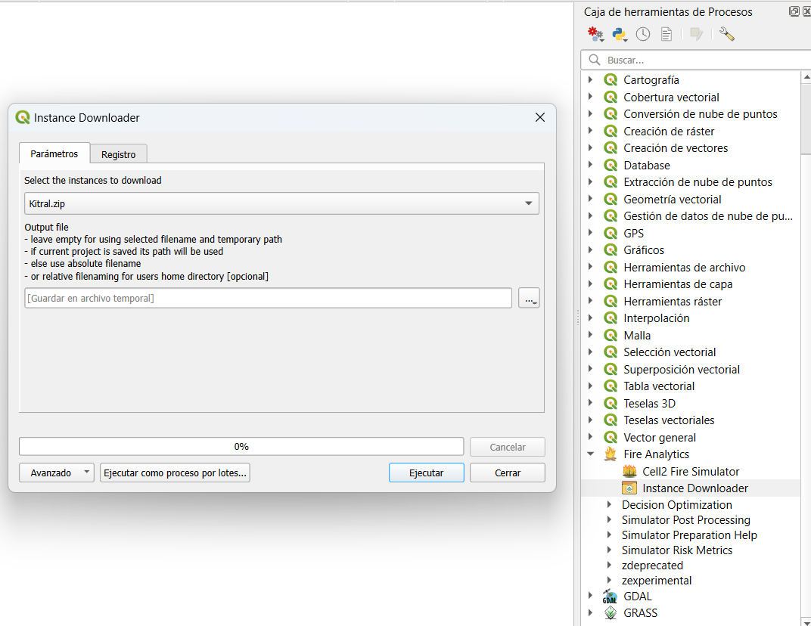

<h3 align="center">

**Manual de usuario QGIS Fire\
Analytics Toolbox**

</h1>

<h3 align="center">

0.2.3

</h3>

<h3 align="center">

Fire Management & Advanced Analytics Group

# Introducción

El complemento de QGIS, Fire Analytics Toolbox, es una herramienta
informática desarrollada por el grupo de investigación
[Fire2A](https://www.fire2a.com/) para la gestión y el análisis de los
incendios forestales. Está diseñado para facilitar la simulación de
incendios forestales, calcular métricas de riesgo y optimizar la
ubicación de tratamientos de combustibles en un paisaje, todo
directamente desde QGIS. La interfaz del plugin permite realizar estas
tareas de manera intuitiva mediante formularios simples y herramientas
de arrastrar y soltar. En este manual se detallan las instrucciones de
instalación, configuaraciones iniciales, funciones principales, ejemplos
de uso y la solución de problemas que puedan ocurrir durante la
utilización de las herramientas.

# Instalación

En esta sección se detalla la instalación de QGIS y de la caja de
herramientas de Fire Analytics (Fire Analytics Toolbox).

1.  Tener instalado o instalar una version de **QGIS igual o posterior a
    3.36.1**. Puedes descargar QGIS desde este
    [enlace](https://qgis.org/ "Descarga QGIS").

2.  Añadir
    [enlace](https://fire2a.github.io/fire-analytics-qgis-processing-toolbox-plugin/plugins.xml)
    del plugin a la pestaña de fuentes personalizables: Menú:
    Plugins/Complementos \> Manage and Install Plugins.../Administrar e
    instalar complementos... \> Settings/Configuración \> Plugin
    Repositories Add/Añadir \> llenar Nombre y pegar URL \> Ok/Aceptar

    -   URL del repositorio:
        <https://fire2a.github.io/fire-analytics-qgis-processing-toolbox-plugin/plugins.xml>

3.  Instalar nuevo plugin:\
    Menú: Plugins/Complementos \> Manage and Install
    Plugins.../Administrar e instalar complementos... \>Not installed/No
    instalado \>search "Fire Analytics Processing-Toolbox" \>Install
    Plugin/Instalar complemento \>Ok

En caso de que el plugin no aparezca inmediatamente, hay dos opciones:

1.  Marcar la casilla del plugin en la sección de plugins instalados.

2.  Reiniciar QGIS.

# Ejemplo de uso

En esta sección se detalla un ejemplo de uso utilizando una zona de
Villarica. Se muestra la obtención de distintos resultados y su
visualización dentro de QGIS.

Para poder utilizar el simulador se necesita como mínimo una capa de
combustibles en formato raster y al menos un archivo en formato csv que
indique la meteorología en el periodo de tiempo a simular en la zona.
Para la meteorología se pueden utilizar condiciones particulares, como
por ejemplo para representar condiciones más adversas o incluso variadas
condiciones meteorológicas.

Si usted dispone de datos propios, puede saltarse el paso 1 de este
tutorial.

1.  Para descargar una instancia, diríjase al índice del plugin en la
    *Caja de herramientas de Procesos* y haga doble click en *Instance
    Downloader*.

    a.  En *Select the instances to download*, elija la opción
        *Kitral.zip*.

    b.  Puede escoger una carpeta en donde guardar los datos o mover los
        datos que le interesen después de descargar la instancia
        (Villarica). Pulse *Ejecutar*.

2.  Guarde un proyecto vacío en la carpeta descargada o en el lugar
    donde guardó los archivos fuels (combustibles), elevation
    (elevación) y la carpeta Weather (clima).

3.  **(Acá voy)** Establezca el CRS (Sistema de Referencia de
    Coordenadas) para el proyecto (cualquiera en metros es suficiente
    para obtener los resultados, sin embargo para una correcta
    geo-referencia se necesita el sistema de coordenadas adecuado). En
    este caso usamos el SRC EPSG:32718 WGS 84 / UTM zone 18S.

4.  Arrastre y suelte capas desde el proyecto principal (Panel del
    Explorador de Archivos) al Panel de Capas.

    a.  Establezca el CRS (Sistema de Referencia de Coordenadas) para
        las capas cargadas.

5.  Abrir el simulador.

## Resultados

Al seleccionar los resultados del algoritmo de simulación, se pueden
elegir entre varias opciones. A continuación, se describen las
alternativas disponibles.

-   Final Fire Scar (Cicatriz final del fuego): Cicatriz final del
    incendio para cada simulación. El formato es archivos .asc
-   Propagation Fire Scars (Cicatrices de propagación del fuego):
    Cicatriz para cada paso de tiempo transcurrido del incendio, para
    cada simulación. Formato archivos .asc
-   Propagation Directed Graph (Grafo dirigido de propagación): Grafo
    que indica la propagación del incendio (de qué pixel a qué pixel
    pasó el fuego). Formato .csv
-   Ignition Points (Puntos de ignición): Los puntos en que empezó el
    fuego en cada simulación. Formato .csv
-   Hit Rate of Spread (Tasa de propagación al impacto): Velocidad de
    propagación del fuego al momento de alcanzar la pixel quemada.
    Formato archivos .asc
-   Flame Length (Longitud de la llama): La distancia medida desde la
    punta promedio de la llama hasta la mitad de la zona de combustión
    en la base del fuego. Formato archivos .asc
-   Byram Intensity (Intensidad de Byram): La tasa de liberación de
    energía (o calor) por unidad de tiempo y por unidad de longitud del
    frente de fuego. Formato archivos .asc
-   Crown Fire Scar (Cicatriz de fuego en la copa) Cicatriz final del
    fuego de copa para cada simulación. Formato archivos .asc
-   Crown Fire Fuel Consumption (Proporción de consumo de combustible en
    fuego de copa). Formato archivos .asc
-   Surface Burn Fraction (Fracción de quema superficial). Formato
    archivos .asc

 

## Algoritmos

### Algortimos de decisión

La caja de herramientas cuenta con una serie de algoritmos, ya sea para
apoyar el proceso de toma de decisiones, o para realizar un post
procesamiento de las simulaciones. Los resultados de los algoritmos
pueden ser obtenidos en diversos formatos (GPKG, TIFF, SHP, etc.) y para
visualizarlos se deben arrastrar las capas correspondientes a la pestaña
de capas del proyecto de QGIS.

-   Raster knapsack optimization
-   Polygon knapsack optimization : Optimiza el problema clásico de la
    mochila utilizando polígonos con atributos de valores y/o pesos, y
    devuelve una capa de polígonos con los polígonos seleccionados.
-   Polygon treatment optimization : Usando los posibles tratamientos
    para cada polígono, maximiza el valor modificado de los polígonos
    tratados.
-   Raster treatment optimization : Maximiza el valor modificado del
    raster tratado, decidiendo qué tratamiento aplicar a cada píxel (o
    no realizar cambios), sujeto a restricciones de presupuesto y área.
-   Raster treatment & teams optimization : Maximiza el valor modificado
    del raster tratado, decidiendo qué tratamiento aplicar y qué equipo
    asignar a cada píxel (o no realizar cambios), sujeto a restricciones
    de presupuesto, área y capacidades del equipo.

### Simulator Post Processing (simpp)

-   Ignition Point(s) (Puntos de Ignición): Entrega los puntos de
    ignición en formato raster
-   (Propagation) Fire Scar(s) (Cicatrices de propagación): A partir de
    las cicatrices finales se puede obtener la probabilidad de quema
    (Burn probability) y un raster/polígono de las cicatrices finales.
-   Propagation Digraph (Digrafo de propagación)
-   Spatial Statistics, cualquiera de: Hit Rate Of Spread, Flame Length,
    Byram Fire Line Intensity, Crown Fire Scar, Crown Fire Fuel
    Consumption Ratio, Surface Burn Fraction

A continuación se presenta la visualización de las capas de probabilidad
de quema y puntos de ignición, usando los correspondientes algoritmos y
una instancia correspondiente a 1.000 incendios en la zona de Villarica.

### Risk Metrics

-   DownStream Protection Value: Raster con el valor de protección
    `aguas abajo` para cada pixel según capa de valores en riesgo, para
    más información visitar la documentación.
-   Betweenness Centrality: Medida propia de grafos que determina hasta
    qué punto un vértice se encuentra en los caminos entre otros
    vértices.
-   Burn Probability: Probabilidad de quema de cada pixel calculada como
    la cantidad de veces que se quemó dicho pixel entre todas las
    simulaciones realizadas.

# Ejemplo de Uso

En esta seccion se detalla un ejemplo de uso utilizando una instancia
descargada del Instance Donwloader correspondiente a la zona de
Villarica. Tambien se muestra la obtencion de distintos resultados y su
visualizacion dentro de QGIS.

Si no se dispone de un raster de modelo de combustible, es posible
obtener uno siguiendo los siguientes pasos:

-   Para utilizar las funciones de la caja de herramientas es necesario
    contar con un set de datos geográficos y meteorológicos. Si ud. no
    dispone de dichos recursos puede utilizar el algoritmo
    `Instance Downloader` para descargar una instancia preparada. Para
    este proyecto de prueba descargaremos la zona de Villarica
    correspondiente al modelo de combustibles de Kitral.  

-   Guarde un proyecto vacío en la carpeta descargada (donde están los
    archivos fuels, elevation y Weather.csv). 

-   Arrastre y suelte capas desde el proyecto principal (Panel del
    Explorador de Archivos) al Panel de Capas. 

-   Establezca el mismo CRS (Sistema de Referencia de Coordenadas) para
    las capas y el proyecto (cualquiera en metros es suficiente para
    obtener los resultados, sin embargo para una correcta geo-referencia
    se necesita el sistema de coordenadas adecuado).  

-   Abra el algoritmo del simulador, seleccione el modelo de combustible
    adecuado (Canada, Kitral o S&B), seleccione la capa de combustible
    en el menú desplegable de combustible y presione ejecutar.

# Referencias

Para más información se recomienda visitar la
[documentación](https://fire2a.github.io/docs/)

Contacto del desarrollador:
