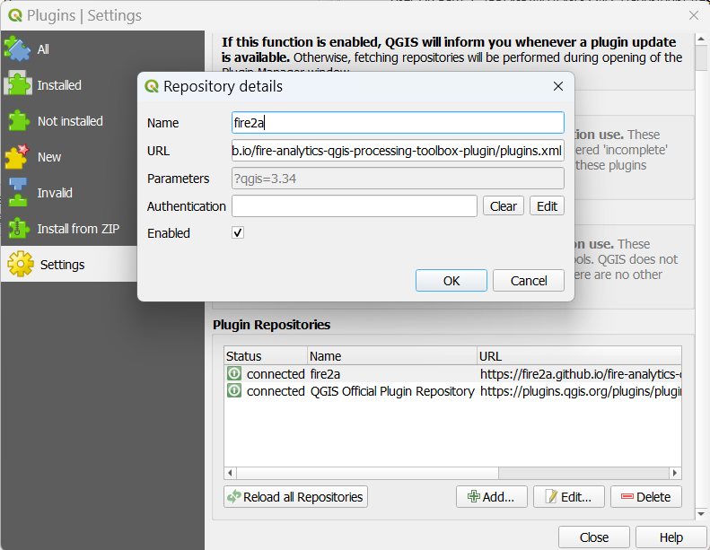
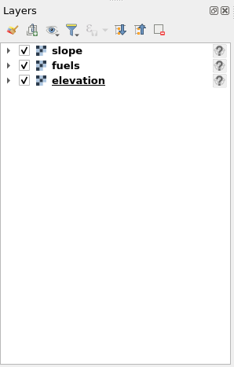
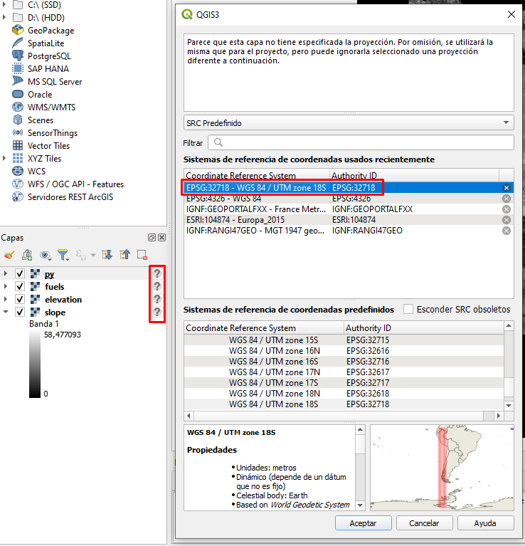

<h1 align="center">Fire Analytics Toolbox</h1>
<h3 align="center">0.2.3</h3>
<h3 align="center">Fire Management & Advanced Analytics Group</h3>


# Introducción
El complemento de QGIS, Fire Analytics Toolbox, es una herramienta informática para la gestión y el análisis de los incendios forestales. Está diseñado para facilitar la simulación de incendios forestales, calcular métricas de riesgo y optimizar la ubicación de tratamiento de combustibles, todo directamente desde QGIS. La interfaz del plugin permite realizar estas tareas de manera intuitiva mediante formularios simples y herramientas de arrastrar y soltar. En este manual se detallan las instrucciones de instalación, configuaraciones iniciales, funciones principales, ejemplos de uso y la solución de problemas que puedan ocurrir durante la utilización de las herramientas.

Desarrollada por el grupo de investigación [Fire2A](https://www.fire2a.com/)

# Instalación

En esta sección se detalla la instalación de QGIS y de la caja de herramientas de Fire Analytics.

## Instalación de QGIS
A continuación se detalla la instalación de QGIS y los requerimientos de paquetes para los diferentes sistemas operativos.

### Windows

Para la instalación en Windows hay dos opciones:
- Instalación desde [enlace](https://qgis.org/en/site/forusers/download.html#windows). Se recomienda la última versión estable.

Para poder ocupar las funciones del Plugin, también es necesario instalar algunas librerías, esto se hace mediante el ambiente de Python que incluye QGIS. A continuación se detallan los pasos a seguir:
1. Guardar el siguiente archivo [requeriments.txt](https://raw.githubusercontent.com/fire2a/fire-analytics-qgis-processing-toolbox-plugin/main/fireanalyticstoolbox/requirements.txt) (segundo click y guardar enlace como)
2. Activar el python de QGIS
3. Escribir `!pip install --upgrade fire2a-lib` y presionar ENTER (ajustar ruta para indicar la ubicación del archivo de requerimientos).

### MacOS
Para la instalación en MacOS, descargar del siguiente [enlace](https://qgis.org/en/site/forusers/download.html#mac).

Instalar requerimientos:
1. Guardar el siguiente archivo [requeriments.txt](https://raw.githubusercontent.com/fire2a/fire-analytics-qgis-processing-toolbox-plugin/main/fireanalyticstoolbox/requirements.txt) (segundo click y guardar enlace como).
2. Abrir terminal

```python
# go to QGIS python location
% cd /Applications/QGIS.app/Contents/MacOS/bin
# install into qgis python environment
% ./python3 -m pip install -r ~/Downloads/requirements.txt
# matplotlib bug: can't find qt_backend
% ./python3 -m pip install --upgrade matplotlib
```

### Linux
En Linux hay tres alternativas:
1. Gnome: Super (or Meta) Key > escribir 'QGIS' >  Clickear 'Install' en la ventana del software
2. Synaptic: Buscar QGIS, clickear install
3. Terminal:
```
sudo apt install qgis qgis-plugin-grass
```

Instalación de requerimientos:
Descargar [requerimientos.txt](https://raw.githubusercontent.com/fire2a/fire-analytics-qgis-processing-toolbox-plugin/main/fireanalyticstoolbox/requirements.txt), [requirements.dev.txt](https://raw.githubusercontent.com/fire2a/fire-analytics-qgis-processing-toolbox-plugin/main/requirements.dev.txt) y Correr la siguiente línea en el terminal:

```python
-m venv --system-site-packages -r requirements.txt, requirements.dev.txt
```

## Instalación del Fire Anlytics Toolbox
1. Añadir [enlace](https://fire2a.github.io/fire-analytics-qgis-processing-toolbox-plugin/plugins.xml) del plugin a la pestaña de fuentes personalizables:
Menú: Plugins > Manage and Install Plugins... > Settings > Plugin Repositories Add > llenar Nombre y pegar URL > Ok
  
1. Instalar nuevo plugin:
   - Menú: Plugins > Manage and Install Plugins... > Not installed > search box fire > select > Install Plugin > Ok
   - Si el plugin no aparece inmediatamente:
      A. Marcar la casilla del plugin en la sección de plugins instalados.
      B. Reiniciar QGIS

# Resultados y algoritmos
En esta sección se detallan los resultados que se pueden obtener a partir del algoritmo de simulación, así como de algoritmos auxiliares de decisión y post-procesamiento.

## Resultados
Al seleccionar los resultados del algoritmo de simulación, se pueden elegir entre varias opciones. A continuación, se describen las alternativas disponibles.

* Final Fire Scar (Cicatriz final del fuego): Cicatriz final del incendio para cada simulación. El formato es archivos .asc
* Propagation Fire Scars (Cicatrices de propagación del fuego): Cicatriz para cada
paso de tiempo transcurrido del incendio, para cada simulación. Formato archivos .asc
* Propagation Directed Graph (Grafo dirigido de propagación): Grafo que indica la propagación del incendio (de qué pixel a qué pixel pasó el fuego). Formato .csv
* Ignition Points (Puntos de ignición): Los puntos en que empezó el fuego en cada simulación. Formato .csv
* Hit Rate of Spread (Tasa de propagación al impacto): Velocidad de propagación del fuego al momento de alcanzar la pixel quemada. Formato archivos .asc
* Flame Length (Longitud de la llama): La distancia medida desde la punta promedio de la llama hasta la mitad de la zona de combustión en la base del fuego. Formato archivos .asc
* Byram Intensity (Intensidad de Byram): La tasa de liberación de energía (o calor) por unidad de tiempo y por unidad de longitud del frente de fuego. Formato archivos .asc
* Crown Fire Scar (Cicatriz de fuego en la copa) Cicatriz final del fuego de copa para cada simulación. Formato archivos .asc
* Crown Fire Fuel Consumption (Proporción de consumo de combustible en fuego de copa). Formato archivos .asc
* Surface Burn Fraction (Fracción de quema superficial). Formato archivos .asc


## Algoritmos
### Algortimos de decisión
La caja de herramientas cuenta con una serie de algoritmos, ya sea para apoyar el proceso de toma de decisiones, o para realizar un post procesamiento de las simulaciones. Los resultados de los algoritmos pueden ser obtenidos en diversos formatos (GPKG, TIFF, SHP, etc.) y para visualizarlos se deben arrastrar las capas correspondientes a la pestaña de capas del proyecto de QGIS.


* Raster knapsack optimization
* Polygon knapsack optimization : Optimiza el problema clásico de la mochila utilizando polígonos con atributos de valores y/o pesos, y devuelve una capa de polígonos con los polígonos seleccionados.
* Polygon treatment optimization : Usando los posibles tratamientos para cada polígono, maximiza el valor modificado de los polígonos tratados.
* Raster treatment optimization : Maximiza el valor modificado del raster tratado, decidiendo qué tratamiento aplicar a cada píxel (o no realizar cambios), sujeto a restricciones de presupuesto y área.
* Raster treatment \& teams optimization : Maximiza el valor modificado del raster tratado, decidiendo qué tratamiento aplicar y qué equipo asignar a cada píxel (o no realizar cambios), sujeto a restricciones de presupuesto, área y capacidades del equipo.

### Simulator Post Processing (simpp)

* Ignition Point(s) (Puntos de Ignición): Entrega los puntos de ignición en formato raster
* (Propagation) Fire Scar(s) (Cicatrices de propagación): A partir de las cicatrices finales se puede obtener la probabilidad de quema (Burn probability) y un raster/polígono de las cicatrices finales.
* Propagation Digraph (Digrafo de propagación)
* Spatial Statistics, cualquiera de: Hit Rate Of Spread, Flame Length, Byram Fire Line Intensity, Crown Fire Scar, Crown Fire Fuel Consumption Ratio, Surface Burn Fraction

A continuación se presenta la visualización de las capas de probabilidad de quema y puntos de ignición, usando los correspondientes algoritmos y una instancia correspondiente a 1.000 incendios en la zona de Villarica.


### Risk Metrics

* DownStream Protection Value: Raster con el valor de protección ``aguas abajo`` para cada pixel según capa de valores en riesgo, para más información visitar la documentación.
* Betweenness Centrality: Medida propia de grafos que determina hasta qué punto un vértice se encuentra en los caminos entre otros vértices.
* Burn Probability: Probabilidad de quema de cada pixel calculada como la cantidad de veces que se quemó dicho pixel entre todas las simulaciones realizadas.

# Ejemplo de Uso
En esta seccion se detalla un ejemplo de uso utilizando una instancia descargada del Instance Donwloader correspondiente a la zona de Villarica. Tambien se muestra la obtencion de distintos resultados y su visualizacion dentro de QGIS.

Si no se dispone de un raster de modelo de combustible, es posible obtener uno siguiendo los siguientes pasos:

* Para utilizar las funciones de la caja de herramientas es necesario contar con un set de datos geográficos y meteorológicos. Si ud. no dispone de dichos recursos puede utilizar el algoritmo ``Instance Downloader`` para descargar una instancia preparada. Para este proyecto de prueba descargaremos la zona de Villarica correspondiente al modelo de combustibles de Kitral.
   
   

* Guarde un proyecto vacío en la carpeta descargada (donde están los archivos fuels, elevation y Weather.csv).
   

* Arrastre y suelte capas desde el proyecto principal (Panel del Explorador de Archivos) al Panel de Capas.
   

* Establezca el mismo CRS (Sistema de Referencia de Coordenadas) para las capas y el proyecto (cualquiera en metros es suficiente para obtener los resultados, sin embargo para una correcta geo-referencia se necesita el sistema de coordenadas adecuado).
   
   

* Abra el algoritmo del simulador, seleccione el modelo de combustible adecuado (Canada, Kitral o S&B), seleccione la capa de combustible en el menú desplegable de combustible y presione ejecutar.

# Referencias
Para más información se recomienda visitar la [documentación](https://fire2a.github.io/docs/)

Contacto del desarrollador:
Matias Vilches
