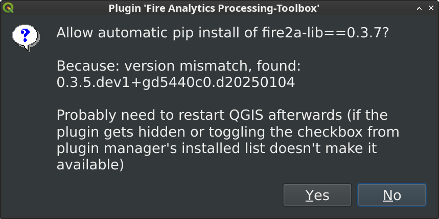
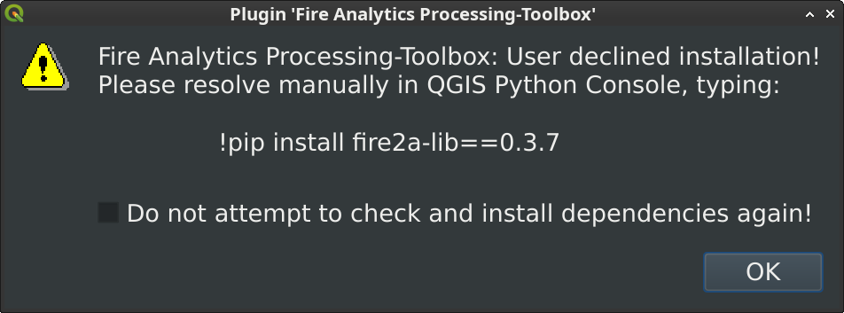

{: .no_toc}
<details open markdown="block">
  <summary>
    Table of contents
  </summary>
  {: .text-delta }
1. TOC
{:toc}
</details>
# tl;dr:
- There are store plugins, custom store plugins, zip releases and manual installations
- Must have plugins: Save All, Serval, IPyConsole, Plugin Reloader, Plugin Builder
- Python dependencies are up to the user to install, but our plugin has a built-in dependency installer

# Installing
QGIS provides a plugin ["app store"](https://plugins.qgis.org/) that allows many developers to share their work.
There are several ways to install plugins, using the plugin manager is the most common way:
## _Search and install_ [official guide](https://docs.qgis.org/latest/en/docs/training_manual/qgis_plugins/fetching_plugins.html#lesson-installing-and-managing-plugins)
## _Install a custom app repository_ [official guide](https://docs.qgis.org/latest/en/docs/training_manual/qgis_plugins/fetching_plugins.html#follow-along-configuring-additional-plugin-repositories)
To install our plugin, add fire2a's [plugin store URL][toolbox-server] as a custom plugin source
- `QGIS menu > Plugins > Manage and Install Plugins > Settings > Add > paste the URL > Ok`
- _Why custom? Audit our [binaries](https://github.com/fire2a/C2F-W/actions)_
<video controls loop style="width: 95%;">
     <source src="img/install_plugin_server.mp4" type="video/mp4">
     Your browser does not support the video tag.
</video>
## _Load a zip release file_
- For example, download the [latest release](https://github.com/fire2a/fire-analytics-qgis-processing-toolbox-plugin/releases/latest) of our plugin.
- Install it using the `Install from ZIP` in the `Plugin Manager`
## Or skip the plugin manager and _manually place the plugin into the plugins directory_
Using `fireanalyticstoolbox` as an example:
### Linux 🗽
```bash
# user plugin directory
~/.local/share/QGIS/QGIS3/profiles/default/python/plugins/fireanalyticstoolbox
# processing plugin directory
/usr/share/qgis/python/plugins/processing
```
### MacOS
```zsh
# QGIS python location
/Applications/QGIS.app/Contents/MacOS/bin/python3
# user plugin directory
~/Library/Application\ Support/QGIS/QGIS3/profiles/default/python/plugins/fireanalyticstoolbox
```
### Windows
```batch
REM QGIS python location
C:\OSGeo4W\bin\python-qgis.bat                    # osgeo4w
C:\Program Files\QGIS 3.40.2\bin\python-qgis.bat  # standalone
REM user plugin directory
C:\Users\<user>\AppData\Roaming\QGIS\QGIS3\profiles\default\python\plugins\fireanalyticstoolbox
```

<a href="#top">back to top</a>
{: style="text-align: right;"}

# Must have plugins!


: [Save All](https://plugins.qgis.org/plugins/SaveAllScript/), Tired of saving temporary layers? Choose a location & new directory, done! every layer gets written, never worry again about temporary or memory layers!


: [Serval](https://plugins.qgis.org/plugins/Serval/), Modify your rasters with your mouse, as if you were using paint!


: [IPyConsole](https://plugins.qgis.org/plugins/IPyConsole/), "No offense, but QGIS python console just sucks." ([sic](https://www.itopen.it/qgis-and-ipython-the-definitive-interactive-console/#comment-140751)) [documentation](http://www.itopen.it/qgis-and-ipython-the-definitive-interactive-console/), [fix to use latest qtconsole](https://github.com/elpaso/qgis-ipythonconsole/compare/master...fdobad:qgis-ipythonconsole:master)


: [Plugin Reloader](https://plugins.qgis.org/plugins/plugin_reloader/), If a plugin starts misbehaving easier to reload it than to restart QGIS


: [Plugin Builder](https://plugins.qgis.org/plugins/pluginbuilder3), Jumpstart your plugin development!

<a href="#top">back to top</a>
{: style="text-align: right;"}

# Python dependencies
Each plugin may have its own unique combination of python dependencies and the combination of various plugins may create unique conflicting version requirements (further read [dependency hell](https://en.wikipedia.org/wiki/Dependency_hell))

|  |  |
|:--:| :--: |
| Our plugin has a built-in dependency installer | But it can be disabled |

That's why the installation of these dependencies is up to the user, so they can control their own environment; __Usually this just means installing the requirements of the plugin at last and restarting QGIS.__ (Any other plugin complaining about a dependencies should be disabled for the time being)


4 ways to manually install python dependencies, using:

## QGIS python console
This is the easiest way but ___Can crash QGIS!___ save your work before trying this

Open the [python console](https://docs.qgis.org/latest/en/docs/user_manual/plugins/python_console.html) to use pip directly from the parent terminal using the escape char `!`, for example type:
```
>>> !pip install -r /path/to/requirements.txt   # to install a list of requirements
>>> !pip install fire2a-lib                     # to install a package
```
Restart QGIS to see the changes

## OSGeo4W shell (Windows)
Open the OSGeo4W shell and activate the custom environment, then use pip as usual:
```batch
C:\OSGeo4W> cd bin
C:\OSGeo4W\bin> python-qgis.bat
>>> exit()
C:\OSGeo4W\bin> pip install -r /path/to/requirements.txt
C:\OSGeo4W\bin> pip install fire2a-lib
```
Start QGIS after the process ends

## Directly (macOS)
Use the bundled python directly:
```zsh
% /Applications/QGIS.app/Contents/MacOS/bin/python3 -m pip install -r /path/to/requirements.txt   # to install a list of requirements
% /Applications/QGIS.app/Contents/MacOS/bin/python3 -m pip install fire2a-lib                     # to install a package
```

## Virtual environment (Linux)
```bash
python -m venv --system-site-packages ~/pyvenv/qgis
source ~/pyvenv/qgis/bin/activate
pip install -r /path/to/requirements.txt   # to install a list of requirements
pip install fire2a-lib                     # to install a package
qgis
```
Start QGIS after the process ends

<a href="#top">back to top</a>
{: style="text-align: right;"}

# Install/Update troubleshoot
## Dissapeared plugin
Sometimes after an update, the plugin doesn't appear on the Processing Toolbox panel: Reload it by pressing on the checkbox next to its name in the `Installed` section of the `Plugin Manager` or restart QGIS.

<video controls loop style="width: 95%;">
  <source src="/docs/qgis-cookbook/img/checkbox_refresh_reloads_plugin.mp4" type="video/mp4">
  Your browser does not support the video tag.
</video>
<a href="#top">back to top</a>
{: style="text-align: right;"}

## Conflicting plugins
A good practice is to enable the least amount of plugins as possible, as they may conflict with each other. If you have a problem, try disabling all plugins and enabling them one by one to find the culprit.

## Processing tools dissapeared
Although it looks like a built in part of QGIS, it can be disabled. Check the `Processing` plugin in the `Plugin Manager`.

---
[toolbox-server]: https://fire2a.github.io/fire-analytics-qgis-processing-toolbox-plugin/plugins.xml
