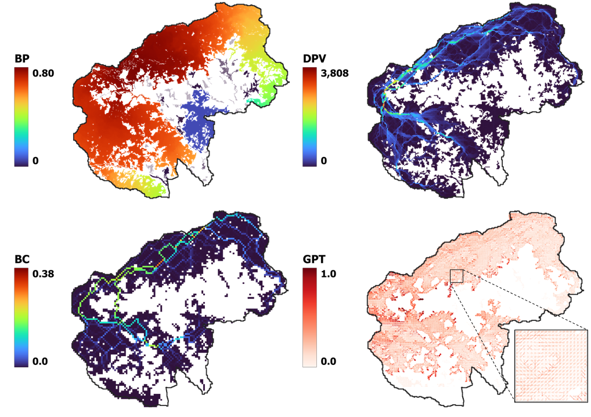

# Cell2FireW simulator

{: .warning}
CLI C++ code; Check the graphical user friendly version: [Fire Analytics Toolbox QGIS plugin](qgis-toolbox)

{: .no_toc}

  

    Table of contents
  

  {: .text-delta }
1. TOC
{:toc}

_Originally forked from [Cell2Fire](https://github.com/cell2fire/Cell2Fire), thanks to the work of Cristobal Pais, Jaime Carrasco, David Martell, [David L. Woodruff](https://github.com/DLWoodruff), Andres Weintraub, et al._

Cell2Fire is a 2D-grid-based forest and wildland landscape fire simulator, focused on large scale areas and fast simulations to provide robust risk spatial analytics, harnessing c++ parallel computation methods.

Current Version:
- [W](https://github.com/fire2a/c2f-w) bundles Spain, Chile and Canada fuel model behaviors!
- _Want your own local fuel model? [Contact us!](getting-help/#how-to-reach-us)_

Released flavors (*no longer maintained*):
- [Scott & Burgan](https://github.com/fire2a/C2FSB)
- [Kitral](https://github.com/fire2a/C2FK)
- [FBP](https://github.com/fire2a/C2FFBP)

# Output examples

## Scott & Burgan
### Previncat's Zone 60 (Catalonian Instance): forest and a simulated fire spread with its corresponding scar and growth propagation tree. 

### Risk metrics: Burn Probability (BP), Betweenness Centrality (BC), Downstream Protection Value (DPV), and Growth Propagation Tree (GPT). 

## Kitral
### El Portillo, simulation with crown fire behavior.

## Canadian Forest Fire Behavior Prediction System

|:-------------|:------------------|
| Dogrib forest, Canada {: width="100%" } | shortest paths propagation {: width="80%" } |
| Shortest paths propagation and ROS intensity {: width="100%" } | Burn-Probability {: width="80%" } |

# Get Cell2FireW
## gui
Most users would want to get the graphical user friendly version: [Fire Analytics Toolbox QGIS plugin](qgis-toolbox)
## cli
Get a ready to use binary (choose your platform), from the [latest release](https://www.github.com/fire2a/C2F-W/releases/latest) page.
## source
- Check the [repo's action artifacts](https://github.com/fire2a/C2F-W/actions) for the latest info on automated builds
- Check the [developer setup guide](https://github.com/fire2a#developer-setup) for a global view
### Linux [Make](compile_linux.html)
### Macos [Make](compile_macos.html)
### Windows [Visual Studio](compile_windows.html)
