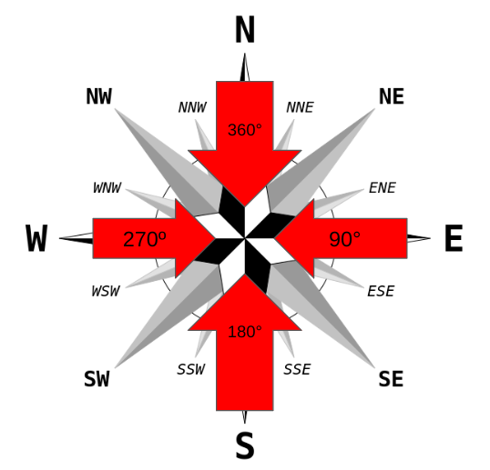
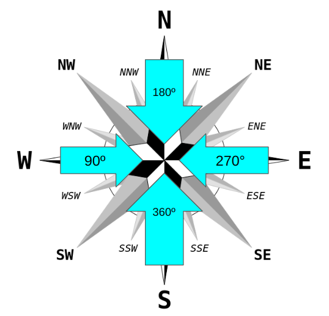

# Wind direction 

Wind direction is generally indicated by the direction from which the wind originates. For example, a north or northerly wind blows from the north to the south.

## Wind direction in meteorology

It is measured in degrees, from 0º to 360º, rotating clockwise in the horizontal plane. 

* Values close to 1º and 360º indicate north wind
* 90º indicate east wind
* 180º south wind
* 270º west wind.

## Wind direction Cell2Fire

In Cell2Fire, the wind is also measured in degrees from 0° to 360°, rotating clockwise in the horizontal plane.

* Values close to 0° or 360° indicate south wind
* 90° indicate west wind
* 180° north wind
* 270° east wind 

| Metereological | Cell2FireW | 
| --- | --- |
| |   |

