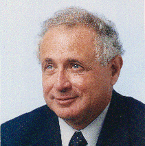

Welcome to Fire2a's research group user documentation, choose your component:

[__QGIS Fire Analytics Toolbox__](qgis-toolbox): Our research as **user friendly graphical tools**: Simulate wildfires, get risk metrics, optimize firebreak location, etc. All from within [QGIS]. **Simple as filling a form**. Also available: drag'n'drop boxes (algorithms) into a *GIS-data-science-pipeline*.

[__Cell2FireW__](Cell2FireW): Forest fire simulator ([Forked]) and improved ([Here]). Supports Canada, Kitral, S&B fuel models , surface and crown fire, deals with weather scenarios, surface and vegetation moisture content; various output metrics. Also enhances in memory management, platform support, etc. **C++ only command line interface.**

[__Algorithms Library__](algo-lib) of common tasks & patterns of GIS. Also showcasing proof of concepts and special algorithms developed such as landscape clustering, firebreak optimization allocation, downstream protection value, etc. **A python package.**

[__QGIS cookbook__](qgis-cookbook): Install & setup guides, python environments, plugins and workflows examples.

[__QGIS management__](qgis-management): Install & setup guides, python environments, plugins and workflows examples.

[__Getting help__](getting-help): How to reach us, before getting help checklist, help message indispensables.

# About us

We are a research group that seeks solutions to complex problems arising from the terrestrial ecosystem and its natural and anthropogenic disturbances, such as wildfires.

Currently hosted at [ISCI](https://isci.cl) offices.

Contact us at <a href="mailto:fire2a@fire2a.com">fire2a@fire2a.com</a>.

Visit our public <a href="http://www.fire2a.com">webpage</a>.

[{: width="40" }](https://www.dii.uchile.cl/~aweintra/)
[](https://github.com/car0espinoza/)
[](https://github.com/fdobad/)
[](https://github.com/FelipedlB/)
[](https://github.com/jaimecarrasco/)
[](https://github.com/matiasuno/)
[](https://github.com/matilderivas/)
[](https://github.com/RodrigoMahalufRecasens/)

[](https://github.com/antoniochavez18/)
[](https://github.com/diegoteran99/)
[](https://github.com/Sigggma/)
[](https://github.com/fulloaf/)
[](https://github.com/fire2a/)
[](https://github.com/lucasmurray97/)
[](https://github.com/R4miro-P/)
[](https://github.com/sebarojasmorales/)

### _About this page_  
It's all [markdown!](markdown_kitchen_sink.html)  
[content license](https://github.com/fire2a/docs/raw/refs/heads/main/LICENSE)  
[just-the-docs-licence](https://github.com/just-the-docs/just-the-docs-template/raw/refs/heads/main/LICENSE)

---
[QGIS]: https://qgis.org
[Forked]: https://github.com/cell2fire/Cell2Fire/
[Here]: https://github.com/fire2a/C2F-W/
