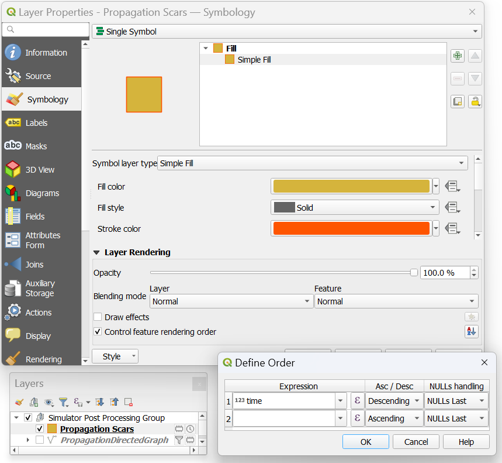
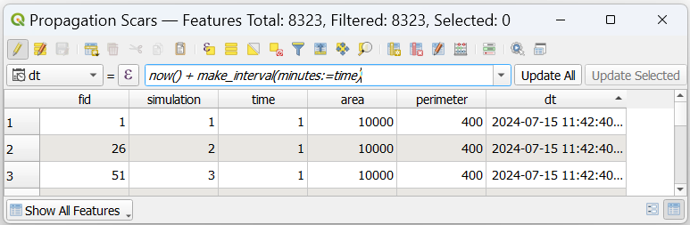
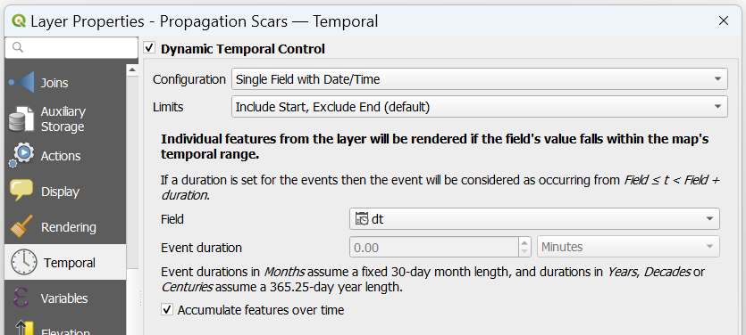
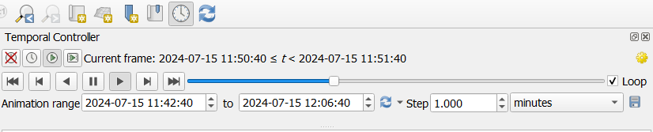
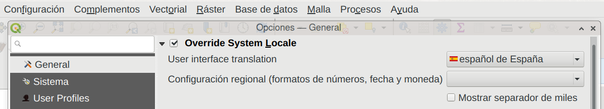

{: .no_toc}
<details open markdown="block">
  <summary>
    Table of contents
  </summary>
  {: .text-delta }
1. TOC
{:toc}
</details>

# Check a fire2a algorithm's html log from WSL
_Did you accidentally close the algorithm's dialog window, and at reopening the execution log is gone? We got you covered:_
- [Open the log messages panel](https://docs.qgis.org/latest/en/docs/user_manual/introduction/general_tools.html#log-messages-panel)
- Look for the `fire2a` tab
- Each algorithm execution is timestamped, identified by its name and the location of its log file, copy the location of the log file
- Open a terminal and navigate to the log file location
- Start a python [http server](https://docs.python.org/3/library/http.server.html) to visualize the html log file back in windows
```bash
cd /tmp/processing_vYybGp/8a8bd04a438641cf8a780de0dbe7eea6/InstanceDirectory/results
python3 -m http.server
    Serving HTTP on 0.0.0.0 port 8000 (http://0.0.0.0:8000/) ...
    127.0.0.1 - - [24/Jan/2025 22:48:48] "GET / HTTP/1.1" 200 -
# stop the server with Ctrl+C or closing the terminal
```
- Back on Windows, open your favorite web-browser (firefox) and open [http://localhost:8000/](http://localhost:8000/)

# Animate a vector layer to record a fire spread video
1. Simulate a fire with propagation scars and/or propagation digraph
2. Create a datetime (or date if datetime not available) type field in the vector layer attribute table
3. Fill the field with a formula similar to:

    ```
    now() + make_interval(minutes:=time)
    now() + make_interval(days:=time) 
    ```
4. Open the "Temporal" setting of the layer to use this field as the temporal field
5. Open the "Time Manager" feature in QGIS

<video controls loop style="width: 33%;">
  <source src="./img/animate_fire.mp4" type="video/mp4">
  Your browser does not support the video tag.
</video>

| Detailed Examples |
|:---:|
| Additional layer styling: make the polygons semi transparent and add borders |
|  |
| example of attribute table with datetime field |
|  |
| example layer temporal controller |
|  |
| example QGIS animation controller |
|  |

# Override QGIS language
Sometimes weird things happen because translations are not fully compatible (for example non-posix characters like " ",á,é,ñ,ö,etc.). We recommend installing the default English QGIS, else you can override the locale like this:
- From qgis menu, click Settings > Options > General > Override System Locale & User interface translation : Make sure is "American English"



---
[QGIS]: https://qgis.org
[requirements.txt]: https://raw.githubusercontent.com/fire2a/fire-analytics-qgis-processing-toolbox-plugin/main/fireanalyticstoolbox/requirements.txt 
[requirements.dev.txt]: https://raw.githubusercontent.com/fire2a/fire-analytics-qgis-processing-toolbox-plugin/main/requirements.dev.txt
[Scott&Burgan-dialog-server]: https://fdobad.github.io/qgis-processingplugin-template/plugins.xml
[Kitral simulator dialog-server]: https://fdobad.github.io/fire2am-kitral/plugins.xml 
[Processing-Toolbox-server]: https://fire2a.github.io/fire-analytics-qgis-processing-toolbox-plugin/plugins.xml
[toolbox-releases]: https://fire2a.github.io/fire-analytics-qgis-processing-toolbox-plugin/releases
[toolbox-repo]: https://www.github.com/fire2a/fire-analytics-qgis-processing-toolbox-plugin
[kitral-dialog-requirements.txt]: https://raw.githubusercontent.com/fdobad/fire2am-kitral/main/requirements.txt
[TODO-Cell2Fire-requirements.txt]: https://github.com/fire2a/C2F-W

[toolbox-server]: https://fire2a.github.io/fire-analytics-qgis-processing-toolbox-plugin/plugins.xml
[fetching plugins]: https://docs.qgis.org/latest/en/docs/training_manual/qgis_plugins/fetching_plugins.html
[custom]: https://docs.qgis.org/latest/en/docs/training_manual/qgis_plugins/fetching_plugins.html#basic-fa-configuring-additional-plugin-repositories
[new plugin]: https://docs.qgis.org/3.28/en/docs/training_manual/qgis_plugins/fetching_plugins.html#basic-fa-installing-new-plugins
