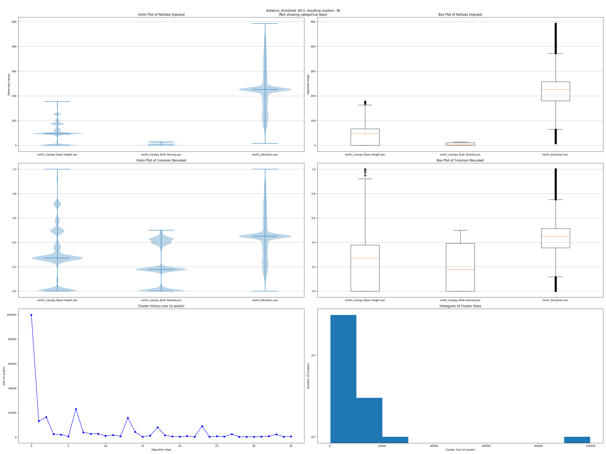

# Polygonize weighted rasters

Create polygons from multiple raster layers; with nodata and scaling strategies, categorical rasters handling and __arbitrary weight attributes__ that modifies the underlying agglomerative clustering algorithm.

<video controls loop style="width: 100%;">
      <source src="./img/algo_polygonize_rasters.mp4" type="video/mp4">
      Your browser does not support the video tag.
</video>

Can also plot a summary of the data distributions and clustering sizes history.

## Overview
A scikit-learn pipeline that:
1. Handles nodata with [SimpleImputer](https://scikit-learn.org/stable/modules/generated/sklearn.impute.SimpleImputer.html)
2. Scales data with [StandardScaler](https://scikit-learn.org/stable/modules/generated/sklearn.preprocessing.StandardScaler.html), [RobustScaler](https://scikit-learn.org/stable/modules/generated/sklearn.preprocessing.RobustScaler.html) which removes outliers or [OneHotEncoder](https://scikit-learn.org/stable/modules/generated/sklearn.preprocessing.OneHotEncoder.html) for categorical data like fuel models.
3. Rescales all observations to [0, 1], then multiplies a prioritization (weight) to each raster.
4. Clusterizes the map using the [Agglomerative](https://scikit-learn.org/stable/modules/generated/sklearn.cluster.AgglomerativeClustering.html) clustering algorithm.

## Usage
1. Select the rasters: notice you can drag & drop to *reorder* them.
2. Optionally fill the matrix *in the same order* than the selected rasters, with
- scaling_strategy = ["standard", "robust", "onehot"] (default is "standard")
- no_data_strategy = ["mean", "median", "most_frequent", "constant"] (default is "mean")
- fill_value = any number (only for "constant" no_data_strategy) (default is 0)
- weight = any number (default is 1)
**Categorical rasters (like fuel models) should use "onehot" and "most_frequent"**
3. Experiment with the distance threshold until you get the desired number of clusters. Less distance (until 0) yields more clusters and processing time.
4. Fine tune the output, ensuring clusters have a minimum number of pixels using the advanced parameter -that invokes GDAL's: [gdal_sieve](https://gdal.org/en/latest/programs/gdal_sieve.html#gdal-sieve)

5. Outputs: The output polygon layer has the attribute 'number of pixels'. The raster layer can be skipped.
6. Data debug: There's an additional option to raise a (mat)plot(lib) window with original & rescaled data distributions, clustering sizes history & histogram labels. Available outside QGIS, by executing the shown command adding the '--plots' flag in the terminal (OSGeo4WShell).

In depth documentation and source code can be found [here](https://fire2a.github.io/fire2a-lib/fire2a/agglomerative_clustering.html)

